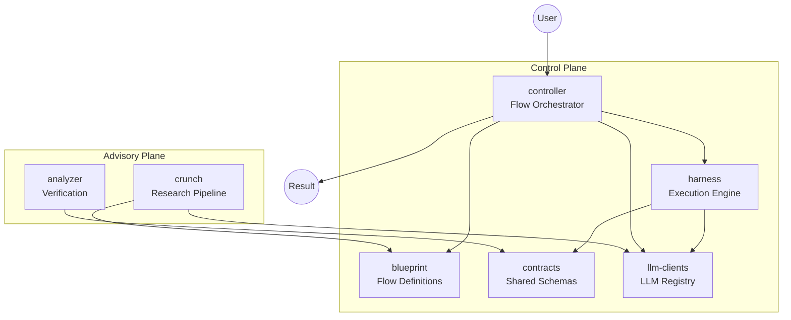
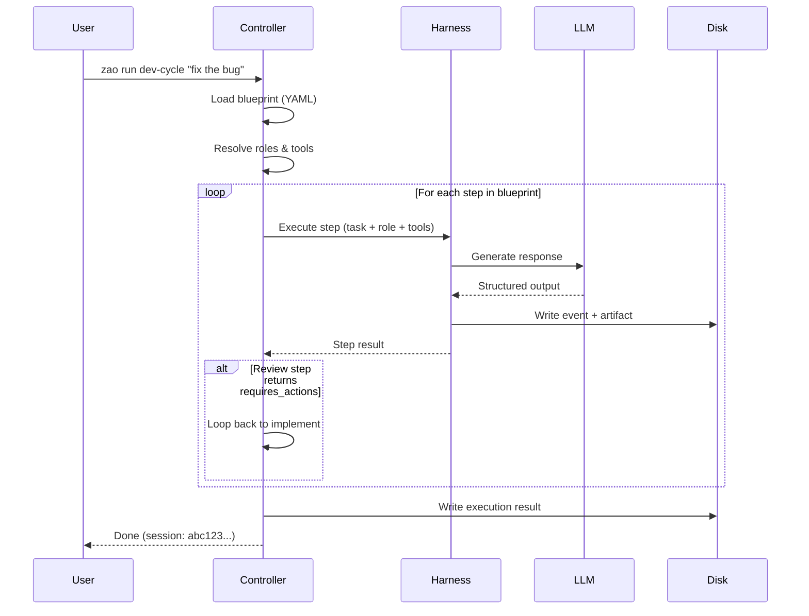

# zao Architecture Overview

zao is an LLM agent orchestration platform organized as a **two-plane architecture**:

## Two-Plane Architecture



### Control Plane

The **control plane** is the operational layer — it executes flows, manages sessions, and enforces governance. It is deterministic and file-based: every action produces a schema-validated artifact, and session state is stored as JSON files in `~/.zao/sessions/`.

| Component | Role |
|-----------|------|
| **harness** | Single-job LLM executor. Manages sessions, token budgets, compaction, checkpoints, and branching. |
| **controller** | Multi-step flow orchestrator. Loads blueprints, dispatches steps to harness, handles loops, and manages the human-in-the-loop gate. |
| **blueprint** | Declarative flow definitions (YAML). Defines steps, roles, tool access, and loop behavior. |
| **contracts** | Shared Zod schemas for all artifacts: sessions, events, blueprints, roles. Single source of truth. |
| **llm-clients** | LLM provider registry. Manages API keys, model resolution, and client lifecycle. |

### Advisory Plane

The **advisory plane** is the analysis layer — it researches problems and verifies outputs. It is invoked before or after control-plane execution to inform decisions.

| Component | Role |
|-----------|------|
| **crunch** | Multi-perspective LLM research pipeline. Takes a question, researches from architecture/security/testing angles, synthesizes findings, and emits a blueprint. |
| **analyzer** | Post-execution verification. Validates artifacts against governance rules, checks for guard violations, and flags issues. |

## Component Map

```
packages/
├── harness/          Control plane: execution engine
│   ├── src/core/     Core logic (loop, context, compaction, delegation, branch, checkpoints)
│   ├── src/cli/      CLI commands (session list/show/tree, branch)
│   └── src/schemas/  Internal schemas (session manifest, index, event log)
├── controller/       Control plane: flow orchestrator
│   └── src/          Flow executor, human gate, CLI, sandbox, execution store
├── blueprint/        Control plane: flow definitions
│   └── defaults/     Built-in blueprints (dev-cycle, code-review, bug-fix, etc.)
├── contracts/        Control plane: shared schemas
│   └── schemas/      Zod schemas for all cross-package contracts
├── llm-clients/      Control plane: LLM registry
│   └── src/          Provider registry, client lifecycle, model config
├── crunch/           Advisory plane: research pipeline
│   └── src/          Multi-perspective research, synthesis, blueprint emission
└── analyzer/         Advisory plane: verification
    └── src/          Post-execution analysis, guard checking
```

## Key Design Principles

1. **File-based state machine**: All session state is in files (`session.json`, `events.jsonl`, `result.json`). No in-memory state. Restart-safe.
2. **Schema-first**: Every artifact validates against a Zod schema before writing. Invalid output is rejected (fail-closed).
3. **Atomic writes**: All file writes use temp-file-then-rename, ensuring crash safety.
4. **Append-only events**: `events.jsonl` is append-only. Events are never modified after writing.
5. **Session immutability**: Completed sessions are immutable. Branching creates a new peer session — the original is never modified.
6. **Human-in-the-loop**: Irreversible actions (compaction, branching, tool execution) require human approval. `--yes` can auto-approve non-destructive actions.

## Flow of a Typical Run


